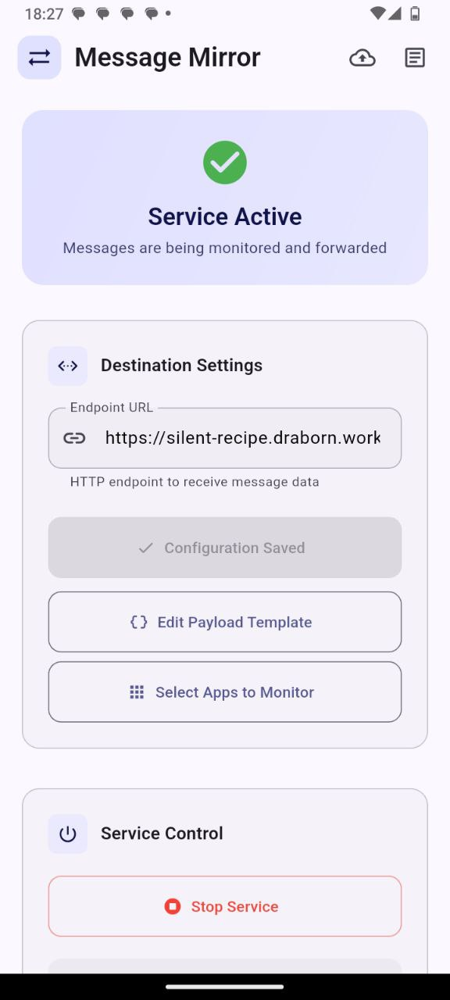
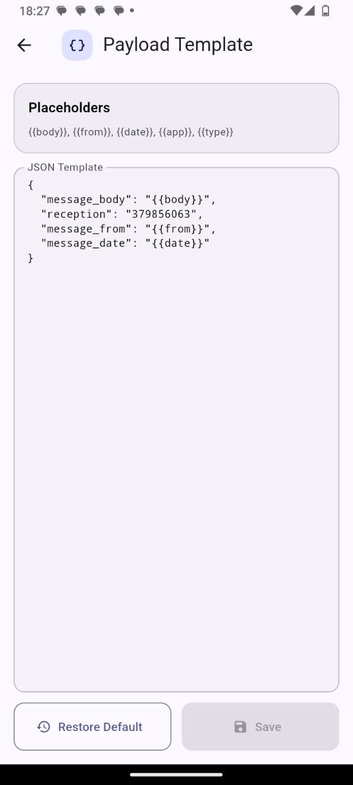
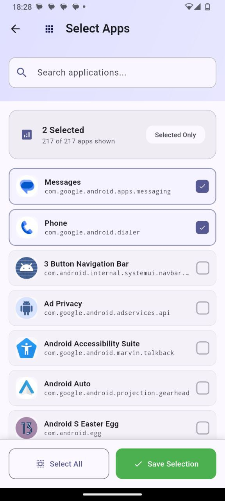

# Message Mirror

Always-on Android companion that captures notifications (and optional SMS) on your device and forwards them to a configured HTTP endpoint. Built with Flutter + minimal Kotlin.

<p align="center">
  
  
  
  <br/>
</p>

## Features

- Foreground service keeps the app alive; auto-starts after boot
- Notification capture via `NotificationListenerService`
- Optional full SMS body capture via `ContentObserver` (READ_SMS)
- Endpoint forwarding (JSON): reception, message_body, message_from, message_date
- App filtering: pick which apps to forward (with icons, search, runtime cache)
- Deduplication of repeated notifications/SMS
- Robust delivery: events bridged to Dart; native HTTP fallback if Dart not ready; retry queue with exponential backoff
- Persistent settings: reception, endpoint, allowed packages, SMS toggle; queue persists across restarts
- Logs: in-app screen plus mirrored to logcat (`tag: MsgMirror`), with copy/clear/auto refresh
- Queue viewer: in-app screen to review pending, unsent items

## Permissions & Manifest

Declared in `android/app/src/main/AndroidManifest.xml`:

- `INTERNET` – send HTTP requests
- `POST_NOTIFICATIONS` (Android 13+)
- `ACCESS_NETWORK_STATE` – read Data Saver status for UX and guidance
- `FOREGROUND_SERVICE` – run foreground service
- `READ_SMS` – optional, only if enabling SMS observer
- `RECEIVE_BOOT_COMPLETED` – auto start service at boot
- `QUERY_ALL_PACKAGES` – broad visibility (OEMs). Also explicit queries for:
  - `com.google.android.apps.messaging`
  - `com.google.android.dialer`

Registered components:

- Service `AlwaysOnService` – foreground, hosts headless Flutter engine
- Service `MsgNotificationListener` – `NotificationListenerService`
- Receiver `BootReceiver` – starts `AlwaysOnService` after boot
- Receiver `NotifEventReceiver` – bridges broadcasts → Dart channel

## Data Flow (High-level)

1) System posts a notification → `MsgNotificationListener.onNotificationPosted`
2) Listener filters (allowed packages, skip ongoing/group summaries) and logs
3) Listener sends payload via:
   - Broadcast (`lol.arian.notifmirror.NOTIF_EVENT`) → `NotifEventReceiver` → Dart channel
   - Direct channel call if channel is already ready
   - Native HTTP fallback (ApiSender) if channel unavailable
4) Dart (`MessageStream`) receives event on channel, formats payload, dedups, sends to endpoint
5) Logs recorded throughout (native + Dart; also to logcat)

## JSON Payload

```
{
  "message_body": "Hello world",
  "message_from": "Arian",
  "message_date": "2025-09-03 19:00",
  "app": "com.google.android.apps.messaging",
  "type": "notification"
}
```

Payload notes:
- By default, `app` and `type` are included (type is `notification` or `sms`).
- `reception` is included when configured in settings.
- The payload template supports placeholders: `{{body}}`, `{{from}}`, `{{date}}`, `{{app}}`, `{{type}}`.

## Dart Files (Key)

- `lib/main.dart`
  - App UI (settings, permissions, background service controls)
  - AppBar action to open full-screen Logs
  - Background entrypoint `backgroundMain` for headless engine
- `lib/message_stream.dart`
  - MethodChannel receiver (`msg_mirror`)
  - Builds payloads, deduplicates, filters by allowed packages
  - Sends JSON to configured endpoint; detailed logging
- `lib/prefs.dart`
  - Platform channel (`msg_mirror_prefs`) helpers: get/set reception, endpoint
- `lib/permissions.dart`
  - Permissions bridge for notification access, post notifications, read SMS, battery optimizations
- `lib/logger.dart`
  - Logs bridge (`msg_mirror_logs`) with append/read/clear
- `lib/app_selector.dart`
  - Select installed apps with icons, search, filter “only selected”, runtime cache
- `lib/logs_screen.dart`
  - Full-screen logs viewer with refresh/auto/clear/copy
  - `QueueScreen` to view pending retry items
  

## Kotlin Files (Key)

- `android/app/src/main/kotlin/.../AlwaysOnService.kt`
  - Foreground service; initializes FlutterEngine
  - Creates channels before running Dart; caches engine as `always_on_engine`
  - Registers SMS observer if enabled and permission granted
- `.../MsgNotificationListener.kt`
  - `NotificationListenerService` that filters and emits notifications
  - Broadcasts events and also attempts channel delivery; native HTTP fallback via `ApiSender`
  - Logs lifecycle (`onCreate`, `onListenerConnected`, etc.)
- `.../NotifEventReceiver.kt`
  - Receives broadcasted notification payloads and forwards to Dart channel
  - Chooses UI engine channel if present; falls back to background engine
- `.../BootReceiver.kt`
  - Starts `AlwaysOnService` on boot
- `.../MainActivity.kt`
  - Exposes channels:
    - `msg_mirror_ctrl`: start/stop service, `isServiceRunning`
    - `msg_mirror_prefs`: get/set reception, endpoint, SMS toggle, allowed packages, retry queue (JSON)
    - `msg_mirror_perm`: permissions checks and settings intents; Data Saver status (`getDataSaverStatus`) and settings shortcut
    - `msg_mirror_logs`: append/read/clear logs
    - `msg_mirror_apps`: list installed apps and fetch icons
  - Caches UI engine in `ui_engine` for receivers
- `.../SmsObserver.kt`
  - Optional SMS inbox observer; posts SMS payload to Dart
- `.../LogStore.kt`
  - File-backed log with rotation; mirrors to logcat (tag `MsgMirror`)
- `.../ApiSender.kt`
  - Native HTTP POST fallback (reads endpoint/reception from SharedPreferences)

## Setup

1) Build/install the app (debug or release)
2) Open app and configure:
   - Reception and Endpoint → Save destination
   - Select apps → choose which packages to forward
   - Permissions: grant Notification Access, Post Notifications, (optional) Read SMS
   - Background Service: Start service (UI shows checking state on launch); whitelist from battery optimizations
   - Data Saver: either turn OFF globally, or keep ON and enable Unrestricted data for the app
3) Trigger a test notification from a selected app
4) Check Logs (in-app Logs screen or logcat tag `MsgMirror`)

## Notes & Behavior

- Auto-start after reboot via `BootReceiver` (some OEMs require whitelist)
- Foreground service is `START_STICKY` and restarts after process kills
- Data Saver status mapping (Android): 1=Disabled (OK), 2=Whitelisted (OK), 3=Enabled (restricts background; not OK)
- Deduping:
  - Notifications: key = `app|whenMs`
  - SMS: key = `sms|from|dateMs`
- Skips:
  - Group summaries, ongoing/system background entries
  - Self-app notifications
  - Empty bodies (falls back to title if needed)
- Package visibility: `QUERY_ALL_PACKAGES` plus explicit queries for Google Messages/Dialer

## Troubleshooting

- No events in Logs:
  - Ensure Notification Access is enabled (toggle OFF/ON if needed)
  - Start the foreground service
  - Check `MsgMirror` tag in logcat for `MsgListener onListenerConnected`
- Events logged but no POST:
  - Verify Endpoint and Reception; see `POST done: status=...` or error
  - Some OEMs block background networking without whitelist
  - Ensure Data Saver is OFF or app is whitelisted (Unrestricted data)
- SMS not forwarding:
  - Enable “Enable SMS observer” and grant READ_SMS
  - Some devices restrict SMS access

## Build Tips

- Clean build if UI doesn’t reflect changes:
  - `flutter clean && rm -rf android/.gradle android/build build .dart_tool && flutter pub get`
- Explicitly target entrypoint:
  - `flutter build apk --release -t lib/main.dart`

## Security & Privacy

- Data stays on your device until forwarded to your endpoint
- Be mindful of forwarding other parties’ messages to third-party services

